<div align="center">
  <picture>
    
  </picture>
  
  <br/>
  
  <p>
    <strong>✨ A breathtaking, interactive masterpiece designed to make hearts melt ✨</strong>
  </p>
  
  <p>
    
    
    
    
    
  </p>
</div>

<hr style="border: 1px solid #ff4d6d; opacity: 0.3; margin: 30px 0;">

## 💖 Why This Project Will Melt Their Heart

Welcome to a truly **next-generation web greeting card**. Forget static images or simple videos. This project utilizes advanced DOM manipulation, real-time Canvas rendering, and sophisticated physics to deliver an **unforgettable, cinematic, and deeply romantic experience.**

Every pixel is designed to *impress, tempt, and captivate*. From the glowing neons to the slow-falling memories, it guarantees that anyone who views it will feel incredibly special and deeply loved.

> *"More than just code—it is a magical digital embrace."*

<br/>

## ✨ Immersive 3D & Cinematic Features

- 🏹 **Interactive Archery Mechanics:** Feel the tension! Pull back a perfectly rendered golden SVG bow. A real-time trajectory calculation anchors your shot directly into the glowing heart.
- 🌳 **Recursive Fractal Tree of Love:** Watch a majestic procedural tree grow in real-time, blooming with radiant hearts as it stretches toward the sky.
- 🎆 **Hyper-Realistic Neon Fireworks:** A custom physics engine drives high-fidelity fireworks. Experience air friction, gravity, massive multi-colored radial flashes, and romantic twinkling sparks.
- 📸 **Cinematic Polaroid Rain:** Handpicked memories majestically fall from high up in the sky, drifting seamlessly across the screen with organic 3D rotation and depth.
- 🎵 **Smart Audio Integration:** Beautiful, emotive background instrumentals play seamlessly. Features a sleek, glass-morphism audio toggle UI that blends perfectly into the aesthetics.
- 💎 **Premium UI & UX:** Butter-smooth 60FPS animations, rich glowing drop-shadows, and a color palette scientifically proven to evoke romance and warmth.

<hr style="border: 1px solid #ff4d6d; opacity: 0.3; margin: 30px 0;">

## 🎮 How to Experience the Magic

1. **Aim & Pull:** Click (or tap) and hold the golden arrow. Drag back to pull the tensioned bowstring.
2. **Release & Love:** Let go to fire the arrow straight into the target heart.
3. **Be Mesmerized:** Watch as the screen floods with a warm rose glow, the music swells, the tree blooms, fireworks light the sky, and beautiful polaroid memories slowly cascade down from above!

<div align="center">
  <h3>✨ Try it out and feel the romance! ✨</h3>
</div>

<hr style="border: 1px solid #ff4d6d; opacity: 0.3; margin: 30px 0;">

## 🚀 Quick Start (Local Development)

Want to run this masterpiece locally or customize it for someone truly special? Follow these steps:

### Prerequisites
Make sure you have [Node.js](https://nodejs.org/) installed on your machine.

### Installation
```bash
# Clone the repository
git clone https://github.com/SHARABUMANOJKUMAR/Birthday-Surprise.git

# Navigate into the project
cd Birthday-Surprise

# Install dependencies (Vite)
npm install

# Start the development server and watch the magic unfold
npm run dev
```

<hr style="border: 1px solid #ff4d6d; opacity: 0.3; margin: 30px 0;">

## 🎨 Make It Yours (Customization Guide)

Easily tailor this breathtaking experience to your exact needs. Click the sections below to reveal how:

<details>
<summary><b>🎶 1. Change the Romantic Music</b></summary>
<br/>
Open <code>index.html</code> and update the <code>&lt;audio id="bgMusic"&gt;</code> source URL to your partner's favorite song:

```html
<audio id="bgMusic" loop>
  <source src="YOUR_ROMANTIC_SONG_URL_HERE.mp3" type="audio/mpeg">
</audio>
```
</details>

<details>
<summary><b>📸 2. Update the Falling Memories</b></summary>
<br/>
Inside <code>index.html</code>, look for the <code>&lt;div class="polaroids"&gt;</code> section. Replace the <code>&lt;img src="..."&gt;</code> tags with links to your own cherished photos, and change the <code>&lt;p&gt;</code> text to custom heartfelt messages!
</details>

<details>
<summary><b>✍️ 3. Change the Name / Greeting</b></summary>
<br/>
Open <code>index.html</code> and locate the Hero text. You can change the names and greetings to anything you desire:

```html
<h1 class="hero__line1" id="wLine1">Happy Anniversary</h1>
<h2 class="hero__line2" id="wLine2">My Love</h2>
```
</details>

<hr style="border: 1px solid #ff4d6d; opacity: 0.3; margin: 30px 0;">

## 📂 Architecture & Technologies

- **`index.html`**: The semantic skeleton, precise SVG architecture for the bow, and elegant layout for the floating polaroids.
- **`birthday.css`**: Heavily utilizes CSS variables, Flexbox/Grid, **glass-morphism**, and hardware-accelerated transforms (`translate3d`, `scale`) for buttery smooth, cinema-quality UI transitions.
- **`birthday.js`**: The brilliant brains of the operation. Orchestrates complex [GSAP](https://gsap.com/) timelines for the cinematic sequence, calculates real-time arrow flight math, and houses the custom `requestAnimationFrame` loop that drives the canvas tree and stunning fireworks physics engine.
- **`vite.config.js`**: Configuration for the Vite bundler, ensuring lightning-fast Hot Module Replacement (HMR) and optimized production builds.

---

<div align="center">
  <p><i>Crafted with passion, ❤️, and exquisite code.</i></p>
  <p><b>Because the ones we love deserve the most beautiful experiences. ✨</b></p>
</div>
